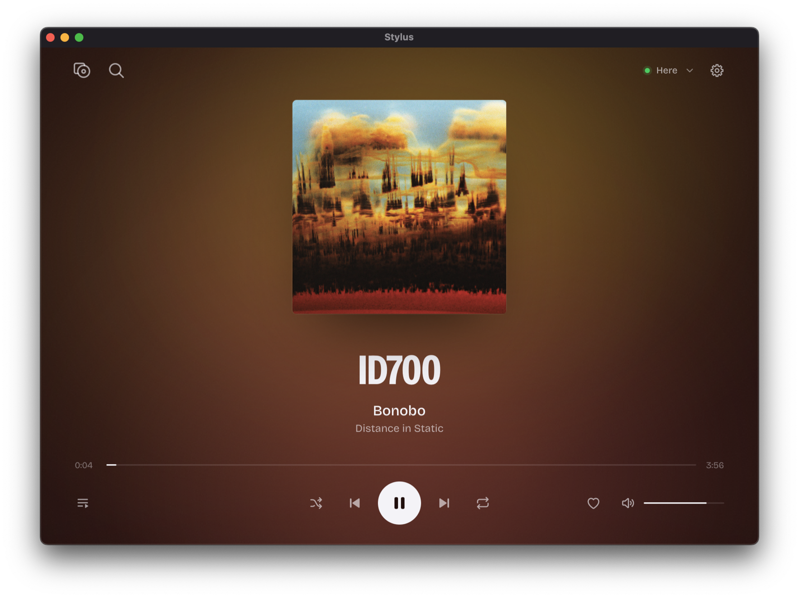
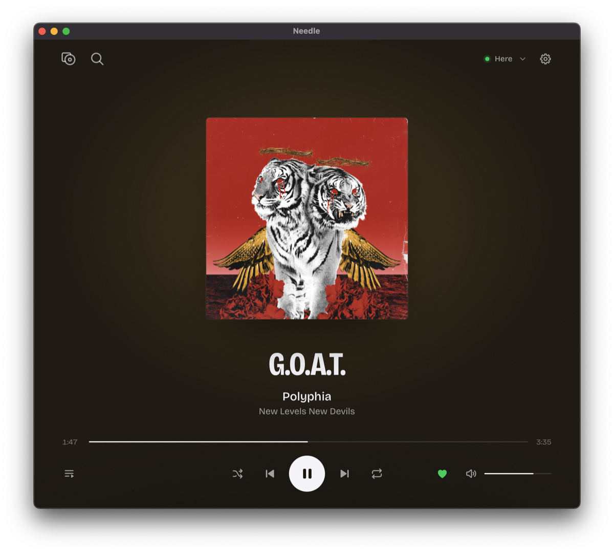

<p align="center">
  
</p>

# Stylus

A small, fast Spotify player for macOS. Stylus plays music on your Mac by itself, so you do not need the 2 GB Spotify desktop app.

<p align="center">
  
</p>

<table>
  <tr>
    <td width="33%"></td>
    <td width="33%"></td>
    <td width="33%"></td>
  </tr>
  <tr>
    <td align="center">Focus layout: one cover, centred</td>
    <td align="center">Library with tabs</td>
    <td align="center">Colours follow the album cover</td>
  </tr>
</table>

## Install

### TL;DR

```sh
brew install --cask 1905/tap/stylus
```

Or download `Stylus.dmg` from [Releases](https://github.com/1905/stylus-spotify-mini-player/releases/latest) and drag Stylus to Applications.

Stylus is not signed with an Apple Developer ID. On first launch, macOS may refuse to open it. Run this once:

```sh
xattr -dr com.apple.quarantine /Applications/Stylus.app
```

### From source — TL;DR

Requires macOS (Apple Silicon), [Rust](https://rustup.rs) 1.85 or later, and Node.js 20 or later.

```sh
git clone https://github.com/1905/stylus-spotify-mini-player.git
cd stylus-spotify-mini-player
npm install
make install   # builds Stylus.app and copies it to /Applications
```

Other targets:

| Command | What it does |
|---|---|
| `make install` | Release build of `Stylus.app` into `/Applications`, then opens it. |
| `make run` | Fresh release build, run as a bare binary from the terminal. It has no Dock icon, so you can tell it apart from the installed app. |
| `make stop` | Quits every running copy. |
| `npx vitest run` | Frontend unit tests. |
| `cargo test --manifest-path src-tauri/Cargo.toml` | Backend unit tests. |

## Requirements

- macOS 13 or later on Apple Silicon.
- A **Spotify Premium** account. Playback through Spotify Connect requires Premium.

### Spotify login

Stylus signs in twice on first launch, both in your browser:

1. **Library access** — the Spotify Web API login (OAuth with PKCE, no client secret).
2. **The player** — the login for the built-in Spotify Connect speaker.

The included client ID belongs to a Spotify developer app in development mode. Spotify only lets accounts on that app's allowlist sign in. To use Stylus with your own account, create an app at [developer.spotify.com](https://developer.spotify.com/dashboard), add the redirect URI `http://127.0.0.1:1420/callback`, and put its client ID in `CLIENT_ID` in `src-tauri/src/auth.rs` before you build.

## Features

- **Plays on your Mac.** Stylus contains its own Spotify Connect speaker, shown as "Here" in the app and as "This Mac" in other Spotify apps. Phones and other devices can send music to it.
- **Controls other devices.** Pick any of your Spotify Connect devices from the device menu.
- **Resumes where you stopped.** The playlist, song, position, volume, shuffle and repeat are restored, paused, when you open the app again.
- **Library and search.** Playlists, Liked Songs, albums, artists with their popular tracks, your top tracks and artists, and search across all of them.
- **Playlist view.** One panel shows what played before, what plays now and what comes next.
- **Two layouts.** A row of covers that shows what played and what comes next, or a single centred cover (Settings → Show cover row).
- **Native feel.** Media keys and Now Playing, the current album cover as the Dock icon, a smooth volume ramp, and instant skip and pause.
- **Audio quality.** Choose 96, 160 or 320 kbps.
- **AI control.** A built-in MCP server lets Claude Code and other AI tools find and play music for you.
- **Low on network.** While Stylus is the active speaker, it reads the player state from the speaker itself instead of polling Spotify.

## Control Stylus from AI tools (MCP)

Stylus includes a local [Model Context Protocol](https://modelcontextprotocol.io) server. AI tools on your Mac, such as Claude Code, Claude Desktop, Cursor or opencode, can then search your music, start playlists and mixes, and control playback in the open app.

1. In Stylus, open **Settings** (the cog) and turn on **MCP server**.
2. Click **Claude Code** or **JSON config** to copy the connect text, and paste it into your client.
3. Ask, for example: *"Play my Bonobo Radio"*, *"Find Kerala by Bonobo and play it"*, *"Turn the volume down a bit"*.

Claude Code:

```sh
claude mcp add --scope user --transport http stylus http://127.0.0.1:5590/mcp --header "Authorization: Bearer <key>"
```

Other clients (`mcpServers` in their config file):

```json
{ "mcpServers": { "stylus": { "type": "http", "url": "http://127.0.0.1:5590/mcp", "headers": { "Authorization": "Bearer <key>" } } } }
```

The copied text already contains your key. **Copy skill** gives a short instruction file for agents; save it as `~/.claude/skills/stylus/SKILL.md`.

**Tools (31):** `now_playing`, `search`, `play`, `pause`, `resume`, `next`, `previous`, `seek`, `set_volume`, `volume_step`, `mute`, `unmute`, `set_shuffle`, `set_repeat`, `queue_add`, `get_queue`, `list_playlists`, `list_mixes`, `playlist_tracks`, `list_albums`, `album_tracks`, `list_artists`, `liked_songs`, `recently_played`, `top`, `artist`, `devices`, `transfer`, `like`, `unlike`, `open_link`. Names such as a playlist or a mix are matched against your library first, then against Spotify search.

**Security:** the server listens on `127.0.0.1` only and runs only while Stylus is open with the setting on. Every request must carry the key; requests without it get `401`. Requests from web pages (with a browser `Origin`) get `403`. **Reset key** in Settings makes a new key and disconnects old clients. Details: [docs/mcp.md](docs/mcp.md).

## How it works

- **App shell:** [Tauri 2](https://tauri.app) with a plain JavaScript frontend.
- **Playback:** [librespot](https://github.com/librespot-org/librespot) 0.8, embedded as a Spotify Connect device, with a custom audio output that applies volume at playback time.
- **Library data:** Spotify's internal endpoints, the same ones the official apps use, through the player's own session. The public Web API is used as a fallback. When Spotify rate-limits the Web API, Stylus respects `Retry-After` and keeps playing.
- **State on disk:** `~/Library/Application Support/stylus/` holds the login tokens, the player credentials (`0600`), the session, settings, a list cache and the log file `logs/stylus.log`.

## Disclaimer

Stylus is an independent project. It is not affiliated with, endorsed by or connected to Spotify. Spotify is a trademark of Spotify AB.

Stylus uses librespot and undocumented Spotify endpoints. Spotify can change or block them at any time. Spotify's terms may not permit this use. Use Stylus at your own risk.

## License

[MIT](LICENSE)
