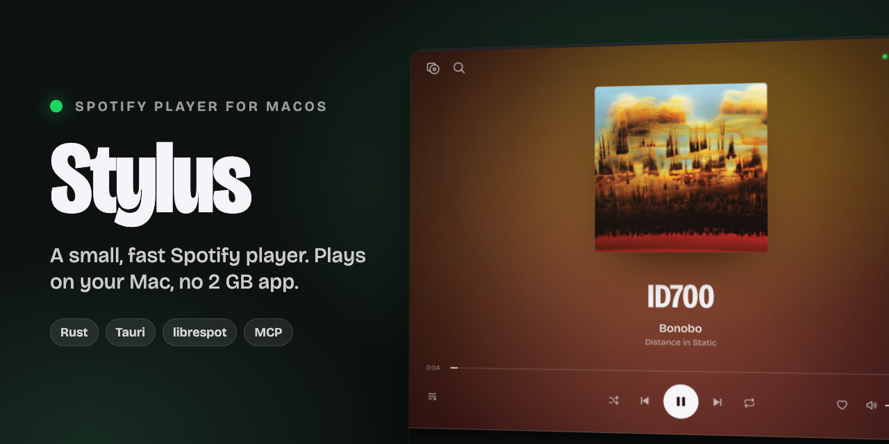
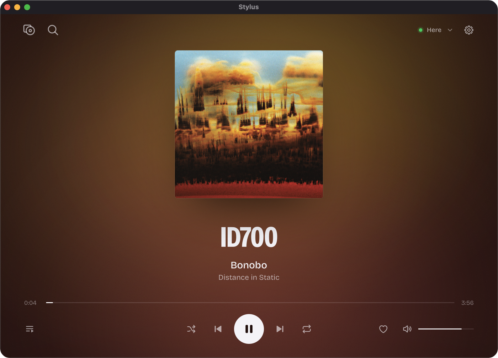
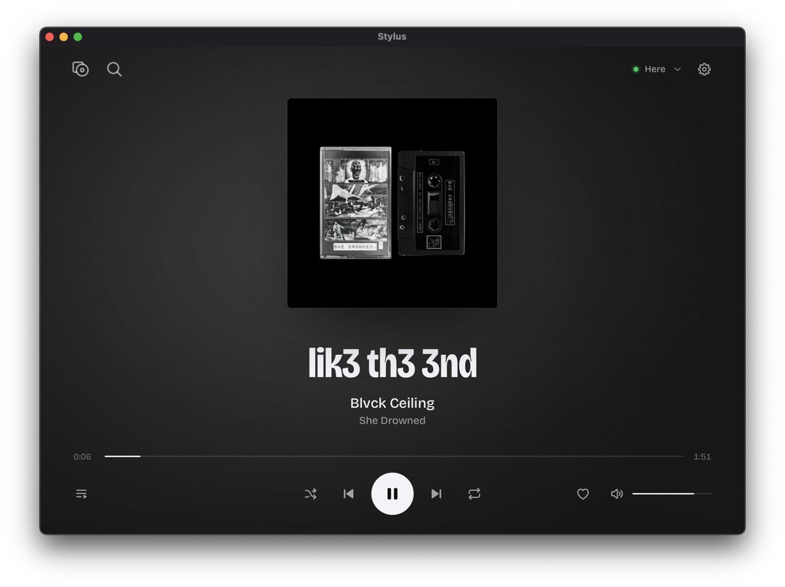
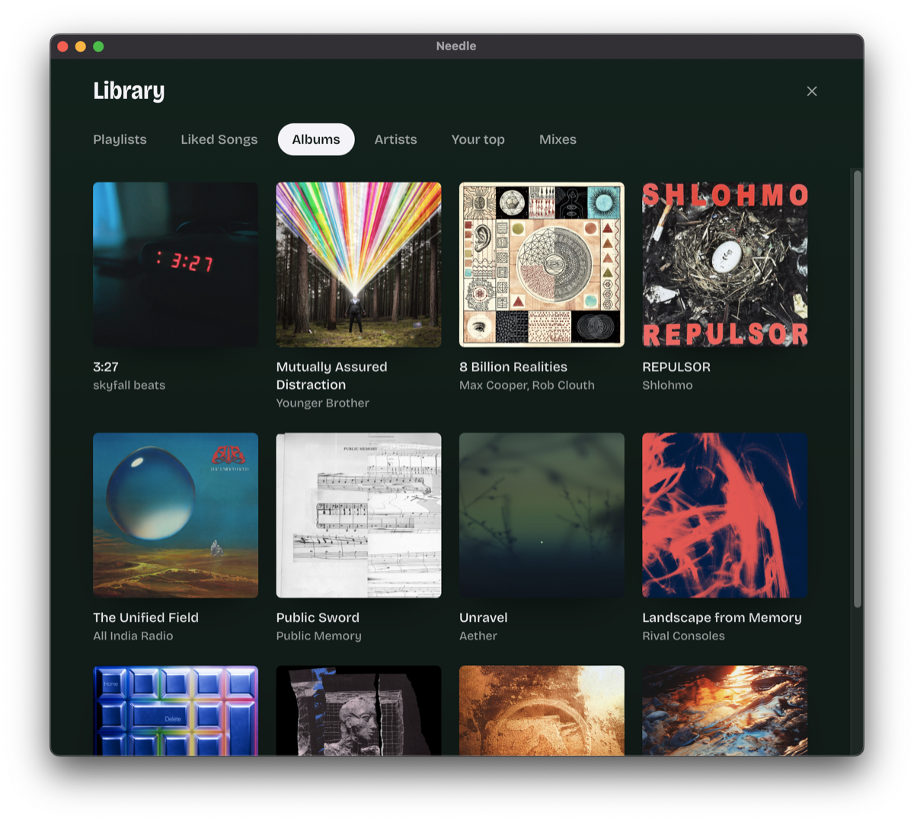
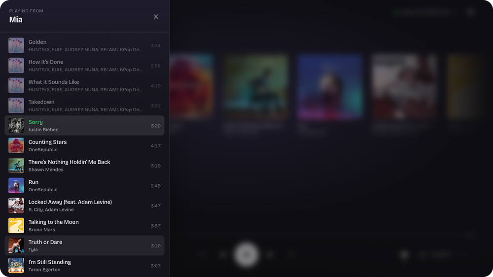
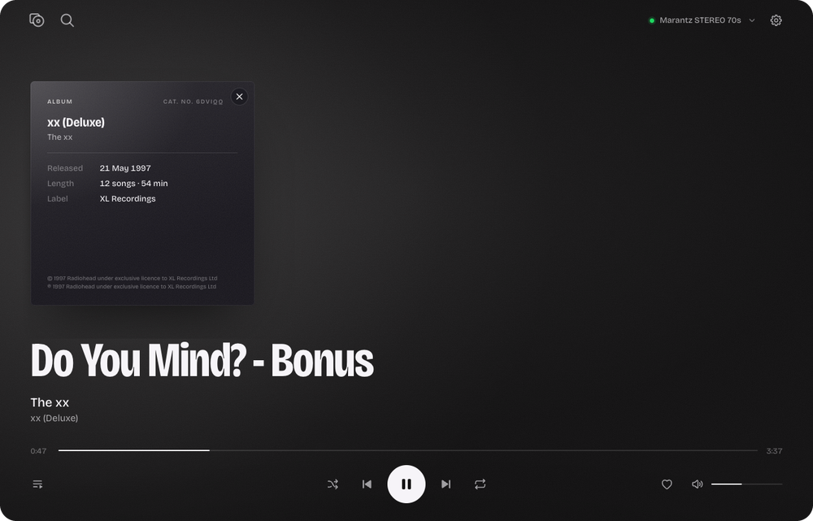
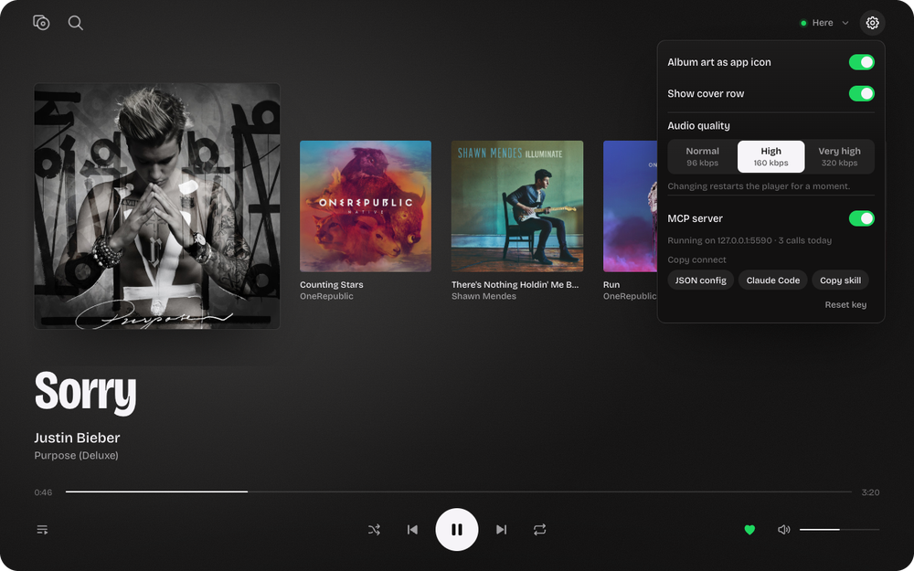

<p align="center">
  
</p>

<h1 align="center">Stylus</h1>

<p align="center">
  <b>A small, fast Spotify player for macOS.</b><br />
  It plays music on your Mac by itself — no 2&nbsp;GB Spotify desktop app needed.
</p>

<p align="center">
  <a href="https://github.com/1905/stylus-spotify-mini-player/releases/latest"></a>
  
  
  
  <a href="LICENSE"></a>
</p>

<p align="center">
  <a href="#install">Install</a> ·
  <a href="#features">Features</a> ·
  <a href="#control-stylus-from-ai-tools-mcp">AI control (MCP)</a> ·
  <a href="#build-from-source">Build from source</a>
</p>

<p align="center">
  
</p>

## Install

```sh
brew install --cask 1905/tap/stylus
```

Or download **Stylus.dmg** from [the latest release](https://github.com/1905/stylus-spotify-mini-player/releases/latest) and drag Stylus to Applications.

> [!NOTE]
> Stylus is not signed with an Apple Developer ID, so macOS may refuse to open it the first time. Run this once:
> ```sh
> xattr -dr com.apple.quarantine /Applications/Stylus.app
> ```

**Requirements:** macOS 13 or later on Apple Silicon, and a **Spotify Premium** account (playback through Spotify Connect requires Premium).

## Features

<table>
  <tr>
    <td width="50%" valign="top">
      <br />
      <b>Plays on your Mac.</b> A built-in Spotify Connect speaker, shown as "Here" in the app and "This Mac" in your other Spotify apps. Colours follow the album cover; choose a row of covers or a single centred one.
    </td>
    <td width="50%" valign="top">
      <br />
      <b>Your library, fast.</b> Playlists, Liked Songs, albums, artists with their popular tracks, your top tracks, Made For You mixes, and search. Add any playlist by pasting its Spotify link.
    </td>
  </tr>
  <tr>
    <td width="50%" valign="top">
      <br />
      <b>Where you are in the playlist.</b> One panel shows what played, what plays now and what comes next. Stylus reopens on the same song, at the same second, paused.
    </td>
    <td width="50%" valign="top">
      <br />
      <b>Turn the record over.</b> The cover flips to show the album details: release date, length, label and credits.
    </td>
  </tr>
  <tr>
    <td width="50%" valign="top">
      <br />
      <b>Settings that matter.</b> Album art as the Dock icon, audio quality up to 320&nbsp;kbps, the cover row, the menu-bar player and the MCP server.
    </td>
    <td width="50%" valign="top">
      <br />
      <b>Menu-bar mini player.</b> Play, skip, volume and like from the menu bar. Media keys and Now Playing work too, and the window can stay closed.
    </td>
  </tr>
</table>

Also: control any of your Spotify Connect devices, smooth volume, instant skip and pause, and a light network footprint — while Stylus is the speaker, it reads playback from the speaker itself instead of polling Spotify.

## Control Stylus from AI tools (MCP)

Stylus includes a local [Model Context Protocol](https://modelcontextprotocol.io) server, so Claude Code, Claude Desktop, Cursor and other AI tools on your Mac can find and play music for you.

1. Open **Settings** (the cog) and turn on **MCP server**.
2. Click **Claude Code** or **JSON config** to copy the connect text, then paste it into your client.
3. Ask: *"Play my Bonobo Radio"*, *"Find Kerala by Bonobo and play it"*, *"Turn it down a bit"*.

```sh
claude mcp add --scope user --transport http stylus http://127.0.0.1:5590/mcp --header "Authorization: Bearer <key>"
```

<details>
<summary>Other clients, tools and security</summary>

Other clients (`mcpServers` in their config file):

```json
{ "mcpServers": { "stylus": { "type": "http", "url": "http://127.0.0.1:5590/mcp", "headers": { "Authorization": "Bearer <key>" } } } }
```

The copied text already contains your key. **Copy skill** gives a short instruction file for agents; save it as `~/.claude/skills/stylus/SKILL.md`.

**Tools (31):** `now_playing`, `search`, `play`, `pause`, `resume`, `next`, `previous`, `seek`, `set_volume`, `volume_step`, `mute`, `unmute`, `set_shuffle`, `set_repeat`, `queue_add`, `get_queue`, `list_playlists`, `list_mixes`, `playlist_tracks`, `list_albums`, `album_tracks`, `list_artists`, `liked_songs`, `recently_played`, `top`, `artist`, `devices`, `transfer`, `like`, `unlike`, `open_link`. Names such as a playlist or a mix are matched against your library first, then against Spotify search.

**Security:** the server listens on `127.0.0.1` only and runs only while Stylus is open with the setting on. Every request must carry the key; requests without it get `401`. Requests from web pages (with a browser `Origin`) get `403`. **Reset key** in Settings makes a new key and disconnects old clients. Details: [docs/mcp.md](docs/mcp.md).

</details>

## Build from source

Requires macOS on Apple Silicon, [Rust](https://rustup.rs) 1.85 or later, and Node.js 20 or later.

```sh
git clone https://github.com/1905/stylus-spotify-mini-player.git
cd stylus-spotify-mini-player
npm install
npx tauri build --bundles app   # → src-tauri/target/release/bundle/macos/Stylus.app
```

<details>
<summary>Make targets (the maintainer builds on a second Mac over SSH)</summary>

| Command | What it does |
|---|---|
| `make install` | Builds `Stylus.app` on the build Mac (`AIR` in the Makefile) and installs it into `/Applications`. |
| `make run` | Fresh release build, run as a bare binary. It has no Dock icon, so you can tell it apart from the installed app. |
| `make dmg` | Builds `Stylus.dmg` for a release. |
| `make test` | Frontend (vitest) and backend (cargo) tests. |
| `make stop` | Quits every running copy. |

</details>

### Spotify login

Stylus has one login: the player login. On first launch, select **Log in with Spotify**. Your browser opens the Spotify login page (OAuth with PKCE, no client secret), and Stylus gets the login for its built-in Spotify Connect speaker. Stylus uses this login for playback and also for your library, search and playlists. The account must have Spotify Premium: without Premium, the login screen says so. You do not need a Spotify developer app.

<details>
<summary>How it works</summary>

- **App shell:** [Tauri 2](https://tauri.app) with a plain JavaScript frontend.
- **Playback:** [librespot](https://github.com/librespot-org/librespot) 0.8, embedded as a Spotify Connect device, with a custom audio output that applies volume at playback time.
- **Library data:** Spotify's internal endpoints, the same ones the official apps use, through the player's own session.
- **State on disk:** `~/Library/Application Support/stylus/` holds the player credentials (`0600`), the session, settings, a list cache and the log `logs/stylus.log`.

</details>

## Report a problem

Choose **File → Show Anonymized Logs in Finder**. Stylus writes a log file that contains only warnings, errors and login steps, with song names, account names, device names and other private data removed, and selects it in Finder. Attach that file to a [GitHub issue](https://github.com/1905/stylus-spotify-mini-player/issues).

## Disclaimer

Stylus is an independent project. It is not affiliated with, endorsed by or connected to Spotify. Spotify is a trademark of Spotify AB.

Stylus uses librespot and undocumented Spotify endpoints. Spotify can change or block them at any time, and Spotify's terms may not permit this use. Use Stylus at your own risk.

## License

[MIT](LICENSE)
